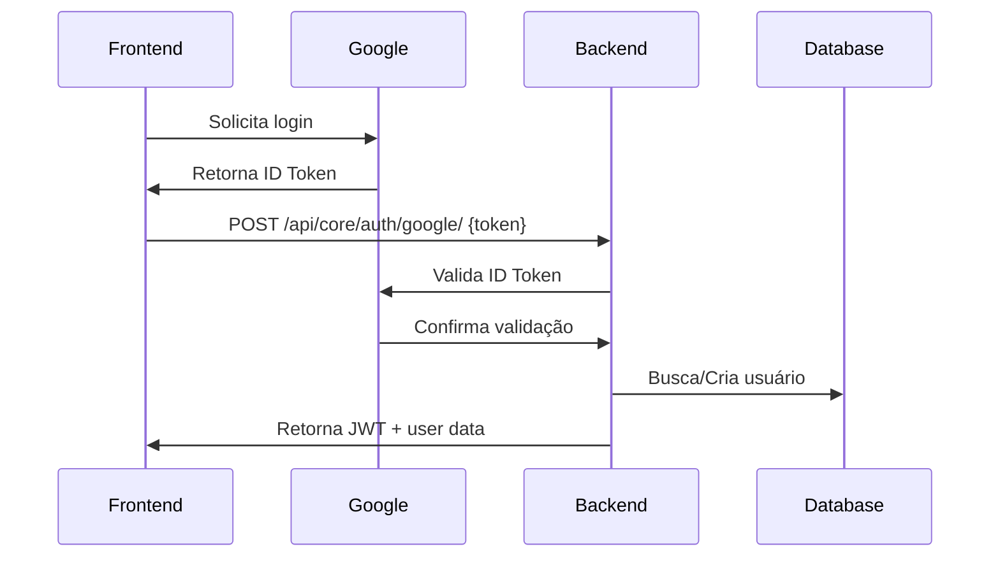

# SSO Google e Certificado Digital - Guia de Implementação

## 📋 Índice

1. [Visão Geral](#visão-geral)
2. [SSO com Google OAuth](#sso-com-google-oauth)
3. [Certificado Digital para NF-e](#certificado-digital-para-nf-e)
4. [Configuração](#configuração)
5. [API Endpoints](#api-endpoints)
6. [Exemplos de Uso](#exemplos-de-uso)

---

## 🎯 Visão Geral

Este documento descreve as novas funcionalidades adicionadas ao sistema:

### **Melhorias no Cadastro de Barbearias (Tenant)**
- Razão social e nome fantasia
- CNPJ, inscrições estadual e municipal
- Endereço completo (logradouro, número, complemento, bairro, cidade, estado, CEP)
- Contatos (telefone, WhatsApp, email, website)
- Branding (logo, cor primária)
- Armazenamento de certificado digital

### **Autenticação SSO com Google**
- Login com conta Google
- Cadastro automático de novos usuários
- Vinculação de contas existentes
- Foto de perfil do Google

### **Certificado Digital A1**
- Upload de certificado .pfx
- Validação automática
- Armazenamento seguro da senha
- Verificação de validade
- Preparação para emissão de NF-e

---

## 🔐 SSO com Google OAuth

### Como Funciona

1. **Usuário faz login com Google** no frontend
2. **Frontend recebe ID Token** do Google
3. **Frontend envia token para o backend** (`/api/core/auth/google/`)
4. **Backend valida o token** com o Google
5. **Backend retorna JWT tokens** + dados do usuário

### Fluxo de Autenticação


```mermaid
sequenceDiagram
    Frontend->>Google: Solicita login
    Google->>Frontend: Retorna ID Token
    Frontend->>Backend: POST /api/core/auth/google/ {token}
    Backend->>Google: Valida ID Token
    Google->>Backend: Confirma validação
    Backend->>Database: Busca/Cria usuário
    Backend->>Frontend: Retorna JWT + user data
```

### Casos de Uso

#### **Caso 1: Novo Usuário**
- Cria conta automaticamente com email do Google
- Não vincula a nenhum tenant (precisa criar ou ser convidado)
- Armazena foto de perfil do Google

#### **Caso 2: Usuário Existente (por email)**
- Vincula conta Google à conta existente
- Atualiza foto de perfil
- Mantém tenant e permissões

#### **Caso 3: Usuário já vinculado**
- Login direto
- Atualiza informações se necessário

---

## 📜 Certificado Digital para NF-e

### O que é Certificado A1?

Certificado digital em arquivo (.pfx) usado para:
- Assinar eletronicamente notas fiscais
- Garantir autenticidade e integridade
- Cumprir exigências legais da Receita Federal

### Validações Automáticas

✅ **Validação de Formato**: Apenas arquivos .pfx  
✅ **Validação de Senha**: Verifica se a senha está correta  
✅ **Validação de Validade**: Certificado não pode estar expirado  
✅ **Aviso de Expiração**: Bloqueia upload se faltar menos de 30 dias  
✅ **Extração de Dados**: CNPJ, emissor, serial number, datas

### Segurança

🔒 **Armazenamento da Senha**:
- Senha é criptografada com `Fernet` (AES-128)
- Chave derivada do `SECRET_KEY` do Django
- **IMPORTANTE**: Em produção, usar biblioteca dedicada como `django-encrypted-model-fields`

🔒 **Armazenamento do Certificado**:
- Arquivo .pfx armazenado em `/media/tenants/certificates/`
- Acesso restrito apenas a admins do tenant
- Nunca exposto via API pública

---

## ⚙️ Configuração

### 1. Google Cloud Console

#### Criar Projeto OAuth

1. Acesse https://console.cloud.google.com/
2. Crie um novo projeto ou selecione um existente
3. Vá em **APIs & Services** > **Credentials**
4. Clique em **Create Credentials** > **OAuth 2.0 Client ID**

#### Configurar OAuth Consent Screen

- **User Type**: External (para usuários públicos)
- **App name**: Nome do seu ERP
- **User support email**: Seu email
- **Scopes**: `email`, `profile`, `openid`
- **Authorized domains**: Seu domínio (ex: `vercel.app`)

#### Criar Client ID

- **Application type**: Web application
- **Authorized JavaScript origins**:
  ```
  http://localhost:3000
  https://seu-dominio.vercel.app
  ```
- **Authorized redirect URIs**:
  ```
  http://localhost:3000
  https://seu-dominio.vercel.app
  ```

#### Copiar Credenciais

Copie o **Client ID** e **Client Secret** para o `.env`:

```env
GOOGLE_OAUTH_CLIENT_ID=123456789-abc.apps.googleusercontent.com
GOOGLE_OAUTH_CLIENT_SECRET=GOCSPX-abc123def456
```

### 2. Backend (.env)

```env
# Google OAuth
GOOGLE_OAUTH_CLIENT_ID=your-client-id.apps.googleusercontent.com
GOOGLE_OAUTH_CLIENT_SECRET=your-client-secret

# (Já existe)
SECRET_KEY=your-secret-key-for-encryption
```

### 3. Dependências

Já instaladas via `requirements.txt`:

```txt
# SSO / OAuth
social-auth-app-django>=5.4.0
google-auth>=2.27.0
google-auth-oauthlib>=1.2.0

# Certificado Digital / NF-e
cryptography>=41.0.0
pyOpenSSL>=24.0.0
Pillow>=10.0.0
```

### 4. Migrations

```bash
cd backend
python manage.py migrate core
```

---

## 📡 API Endpoints

### **1. Login com Google**

```http
POST /api/core/auth/google/
Content-Type: application/json

{
  "token": "eyJhbGciOiJSUzI1NiIsImtpZCI6IjE4MmU0OWUwOT..."
}
```

**Response (200 OK):**

```json
{
  "user": {
    "id": "uuid",
    "email": "user@gmail.com",
    "name": "João Silva",
    "google_id": "1234567890",
    "profile_picture": "https://lh3.googleusercontent.com/a/...",
    "tenant": "tenant-uuid",
    "role": "admin"
  },
  "tenant": {
    "id": "tenant-uuid",
    "name": "Barbearia do João",
    "cnpj": "12.345.678/0001-90"
  },
  "tokens": {
    "access": "eyJ0eXAiOiJKV1QiLCJhbGc...",
    "refresh": "eyJ0eXAiOiJKV1QiLCJhbGc..."
  },
  "is_new_user": false
}
```

**Response (400 Bad Request):**

```json
{
  "error": "Token inválido"
}
```

---

### **2. Upload de Certificado Digital**

```http
POST /api/core/tenants/certificate/upload/
Authorization: Bearer <access_token>
Content-Type: multipart/form-data

{
  "certificate_file": <arquivo.pfx>,
  "password": "senha_do_certificado"
}
```

**Response (200 OK):**

```json
{
  "message": "Certificado instalado com sucesso",
  "certificate": {
    "cn": "EMPRESA:12345678000190",
    "issuer": "AC SERASA RFB v5",
    "serial_number": "123456789",
    "not_valid_before": "2024-01-01T00:00:00Z",
    "not_valid_after": "2025-01-01T23:59:59Z",
    "days_until_expiry": 180,
    "is_valid": true
  }
}
```

**Response (400 Bad Request):**

```json
{
  "error": "Certificado expirado"
}
```

---

### **3. Informações do Certificado**

```http
GET /api/core/tenants/certificate/info/
Authorization: Bearer <access_token>
```

**Response (200 OK):**

```json
{
  "cn": "EMPRESA:12345678000190",
  "issuer": "AC SERASA RFB v5",
  "serial_number": "123456789",
  "not_valid_before": "2024-01-01T00:00:00Z",
  "not_valid_after": "2025-01-01T23:59:59Z",
  "days_until_expiry": 180,
  "is_valid": true
}
```

**Response (404 Not Found):**

```json
{
  "message": "Nenhum certificado instalado"
}
```

---

### **4. Remover Certificado**

```http
DELETE /api/core/tenants/certificate/remove/
Authorization: Bearer <access_token>
```

**Response (200 OK):**

```json
{
  "message": "Certificado removido com sucesso"
}
```

---

## 💻 Exemplos de Uso

### Frontend - Login com Google (React/Next.js)

```tsx
import { GoogleLogin } from '@react-oauth/google';

function LoginPage() {
  const handleGoogleLogin = async (credentialResponse: any) => {
    try {
      const response = await fetch('/api/core/auth/google/', {
        method: 'POST',
        headers: { 'Content-Type': 'application/json' },
        body: JSON.stringify({
          token: credentialResponse.credential
        })
      });
      
      const data = await response.json();
      
      // Salva tokens
      localStorage.setItem('access_token', data.tokens.access);
      localStorage.setItem('refresh_token', data.tokens.refresh);
      
      // Redireciona
      if (data.is_new_user) {
        router.push('/onboarding'); // Usuário novo precisa criar tenant
      } else {
        router.push('/dashboard');
      }
    } catch (error) {
      console.error('Erro no login:', error);
    }
  };
  
  return (
    <GoogleLogin
      onSuccess={handleGoogleLogin}
      onError={() => console.log('Login Failed')}
      text="signin_with"
      shape="rectangular"
      size="large"
    />
  );
}
```

### Frontend - Upload de Certificado

```tsx
import { useState } from 'react';

function CertificateUpload() {
  const [file, setFile] = useState<File | null>(null);
  const [password, setPassword] = useState('');
  
  const handleUpload = async () => {
    if (!file || !password) return;
    
    const formData = new FormData();
    formData.append('certificate_file', file);
    formData.append('password', password);
    
    try {
      const response = await fetch('/api/core/tenants/certificate/upload/', {
        method: 'POST',
        headers: {
          'Authorization': `Bearer ${localStorage.getItem('access_token')}`
        },
        body: formData
      });
      
      const data = await response.json();
      
      if (response.ok) {
        alert(`Certificado instalado! Válido até ${data.certificate.not_valid_after}`);
      } else {
        alert(`Erro: ${data.error}`);
      }
    } catch (error) {
      console.error('Erro no upload:', error);
    }
  };
  
  return (
    <div>
      <h2>Upload de Certificado Digital</h2>
      <input
        type="file"
        accept=".pfx"
        onChange={(e) => setFile(e.target.files?.[0] || null)}
      />
      <input
        type="password"
        placeholder="Senha do certificado"
        value={password}
        onChange={(e) => setPassword(e.target.value)}
      />
      <button onClick={handleUpload}>Enviar Certificado</button>
    </div>
  );
}
```

---

## 🔜 Próximos Passos

### 1. **Emissão de NF-e**
- [ ] Integração com API da SEFAZ
- [ ] Assinatura XML com certificado digital
- [ ] Geração de DANFE (PDF)
- [ ] Envio e consulta de status

### 2. **Frontend Completo**
- [ ] Tela de cadastro de barbearia
- [ ] Botão "Login com Google"
- [ ] Upload de certificado digital
- [ ] Monitoramento de validade do certificado

### 3. **Melhorias de Segurança**
- [ ] Implementar `django-encrypted-model-fields` para senhas
- [ ] Adicionar 2FA (autenticação de dois fatores)
- [ ] Logs de auditoria para acesso ao certificado

---

## 📞 Suporte

Para dúvidas ou problemas:

- **Google OAuth**: https://developers.google.com/identity/protocols/oauth2
- **Certificado Digital**: https://www.gov.br/receitafederal/pt-br/assuntos/orientacao-tributaria/cadastros/certificados-digitais
- **NF-e**: https://www.nfe.fazenda.gov.br/portal/principal.aspx

---

## 📝 Changelog

**Versão 2.0.0** (2025-01-14)
- ✅ Modelo Tenant expandido com dados completos de empresa
- ✅ SSO Google OAuth 2.0 implementado
- ✅ Upload e validação de certificado digital A1
- ✅ Documentação completa
- ⏳ Emissão de NF-e (em desenvolvimento)

**Versão 1.0.0** (2025-01-10)
- Base do sistema multi-tenant
- Cadastro básico de empresas
- Autenticação JWT tradicional
